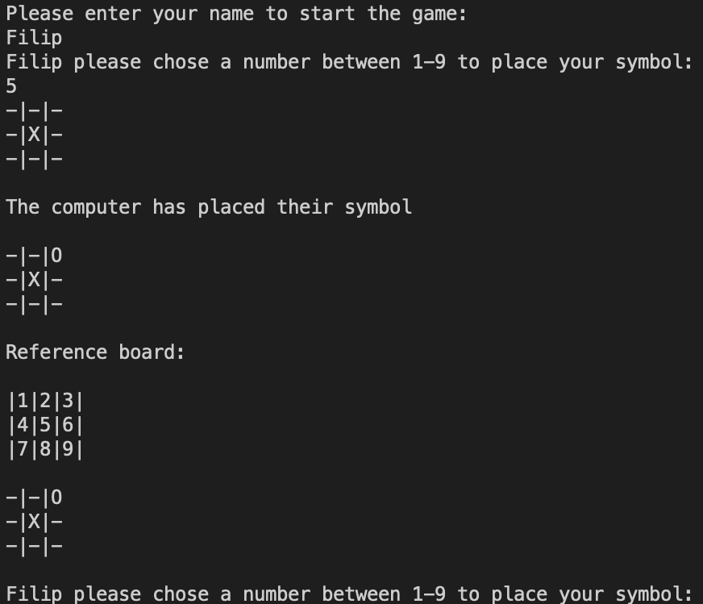
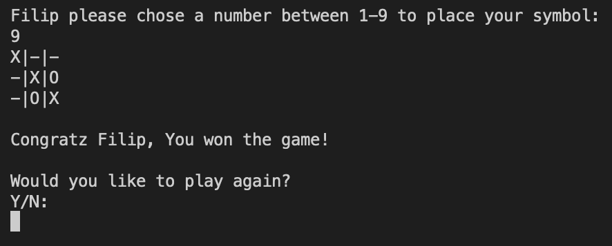

# Tic-Tac-Toe

Tic-Tac-Toe is a python terminal game, which runs on Heroku.
Users can try to beat the computer by getting three of their symbols in a row before the computer.

## How to play

The following rules apply to the Tic-Tac-Toe game:

1. The game is played on a grid that's 3 squares by 3 squares.
2. The user is X and the computer is O.
3. The user and computer take turns to place their symbol on a empty square. 
4. The first player to get 3 of their symbols in a row (up, down, across or diagonally) is the winner.
5. If all 9 squares are full but no player has 3 symbols in a row the game ends in a tie.

## Features

* The user is greeted to the game and the instructions from "How to play" is displayed.
    * The 3x3 board is created and the user is asked to enter their name.

* The user and computer takes turns to place their symbol on a empty square until there is a winner or the game is tied.

* Once the game is over the user is asked if they want to play again. If they say yes the game restarts and else it exits.

## Creating the Heroku app

When you create the app, you will need to add two buildpacks from the _Settings_ tab. The ordering is as follows:

1. `heroku/python`
2. `heroku/nodejs`

You must then create a _Config Var_ called `PORT`. Set this to `8000`

If you have credentials, such as in the Love Sandwiches project, you must create another _Config Var_ called `CREDS` and paste the JSON into the value field.

Connect your GitHub repository and deploy as normal.

## Constraints

The deployment terminal is set to 80 columns by 24 rows. That means that each line of text needs to be 80 characters or less otherwise it will be wrapped onto a second line.

-----
Happy coding!